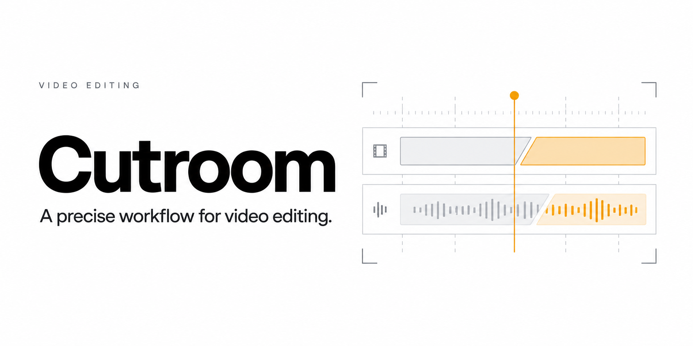

# Cutroom

**Turn raw footage into vertical shorts with an edit plan you can read, change, and render again.**

Cutroom is a local TypeScript editing pipeline. It prepares your footage, produces word timestamps and reference frames, and renders cuts, karaoke captions, punch-ins, overlays, and music from a validated JSON edit decision list. Use it directly from the terminal or let a coding agent write the edit plan with you.

[Quickstart](#quickstart) · [Edit format](#the-edit-is-a-file) · [Agent workflow](#work-with-an-agent) · [Contributing](CONTRIBUTING.md) · [MIT license](LICENSE)

## Why use it?

- **Repeatable editing.** Keep timing, captions, and framing in one inspectable file instead of regenerating a custom renderer for every video.
- **A useful handoff for agents.** Transcripts and sampled frames give an agent concrete evidence; schemas catch invalid plans before rendering.
- **Keep your originals.** Ingest copies footage by default. Normalized media, previews, and exports live in a separate workspace.
- **Review before export.** Render a smaller preview, inspect QC stills, then export the final MP4. Interrupted analysis resumes completed stages.
- **Your own style guide.** Plain Markdown scopes describe pacing, caption treatment, and framing for recurring content formats.

Useful for creators editing recurring explainers, developers building video workflows, and anyone who wants programmable editing without writing React for each clip.

## Quickstart

macOS is the supported setup path. Install **Node.js 22.12 or newer**, Git, and Xcode Command Line Tools. FFmpeg and FFprobe are bundled through npm; an installed system pair takes precedence. Leave enough disk space for your original, a library copy, normalized media, and exports.

```bash
git clone https://github.com/HarshyChoc/cutroom.git
cd cutroom
npm ci
xcode-select --install # skip if the command line tools are already installed
npm run setup
```

Setup compiles the pinned whisper.cpp version and downloads the configured speech model and Remotion's render browser. The default `medium.en` model is approximately 1.5 GB; this first setup needs an internet connection. Defaults live in [`editor.config.json`](editor.config.json).

```bash
# Copy a video into a managed workspace; the original stays where it is.
npm run editor -- ingest --file "/path/to/your-video.mp4"
npm run editor -- status
```

Use the video ID printed by ingest in place of `VIDEO_ID` below. A unique fragment of the ID works too.

```bash
npm run editor -- analyze VIDEO_ID
npm run editor -- plan-init VIDEO_ID
```

Open `content/library/VIDEO_ID/edits/main/edit.json`. The initial plan keeps the whole source. Adjust the segments using the transcript and sampled frames, or ask an agent to do this with you. Then:

```bash
npm run editor -- captions VIDEO_ID
npm run editor -- validate VIDEO_ID
npm run editor -- render VIDEO_ID --preview
npm run editor -- verify VIDEO_ID
# Inspect the video and the stills in edits/main/qc/ before exporting.
npm run editor -- render VIDEO_ID
npm run editor -- verify VIDEO_ID
```

The final video is `content/output/VIDEO_ID--main.mp4`. `studio VIDEO_ID` opens a local Remotion timeline for scrubbing. When both final and preview files exist, `verify` checks the final file.

## The edit is a file

The [`edit.json` schema](shared/schemas/edit.ts) separates creative choices from the renderer. For example, replacing a plan's `segments` with this array keeps two source ranges and plays them consecutively:

```json
[
  { "id": "hook", "sourceInMs": 5000, "sourceOutMs": 8000, "note": "Open on the main idea" },
  { "id": "explanation", "sourceInMs": 12000, "sourceOutMs": 22000, "note": "Keep the complete explanation" }
]
```

This example requires at least 22 seconds of source footage and produces a 13-second edit at normal speed. Source boundaries use **source milliseconds**. Caption and overlay times use **output milliseconds**; transform keyframes use output time relative to their segment. Rebuild captions after changing segments, then validate again.

Three caption presets are included: `bold-center`, `clean-lower`, and `minimal`. The same schema supports reframing, transform keyframes, title cards, text/image overlays, multiple sources, and a music track with ducking. Add your own licensed music under `content/assets/music/`.

## Work with an agent

Open this folder in Codex or Claude Code and ask:

> Take the video in content/raw and make a concise explainer. Follow scopes/explainer.md, preserve the full thought, and show me a preview before the final render.

[`AGENTS.md`](AGENTS.md) and [`CLAUDE.md`](CLAUDE.md) describe the workflow. Companion skills under `.agents/skills/` and `.claude/skills/` cover classification, planning, review, and export copy. The agent supplies editorial judgment; Cutroom does not run an LLM automatically.

Start with [`scopes/explainer.md`](scopes/explainer.md), or copy [`scopes/_template.md`](scopes/_template.md) to define another style. Scope defaults are applied by you or your agent, not automatically parsed by the CLI.

## Files, privacy, and providers

| Location | Contents |
| --- | --- |
| `content/raw/` | Optional drop folder for batch ingest |
| `content/library/<id>/` | Source copy, normalized media, transcript, frames, edit plans, status, and QC stills |
| `content/output/` | Preview and final MP4 exports |
| `scopes/` | Shareable editing guidelines |
| `shared/` | Schemas, caption timing, and timeline helpers |
| `remotion/` | One reusable renderer driven by the edit plan |

Footage, transcripts, library state, music, and renders are ignored by Git. Back up your local `content/` folder separately. Repeating `ingest` on the same unchanged file skips its existing workspace. **`--move` explicitly removes the source from its original location**; copying is the default. Use a different `--edit` name to retain alternate plans and exports.

Default transcription uses local [whisper.cpp](https://github.com/ggml-org/whisper.cpp). Rendering uses a media server bound to `127.0.0.1`; there is no hosted application. An external coding agent may send the files it reads to its own provider according to your agent settings.

An optional ElevenLabs transcription path is available through `transcribe VIDEO_ID --provider elevenlabs`, with `ELEVENLABS_API_KEY` supplied in your shell. That explicitly uploads audio to ElevenLabs and may incur provider charges. No API key is needed for the default local workflow. Dependencies and fonts may need network access on first use.

## Local validation

```bash
npm run typecheck
npm test
npm run editor -- setup --skip-whisper --skip-browser
npm run editor -- status
```

The tests use tiny synthetic video fixtures and check that normal ingest preserves originals and rejects conflicting copy/move options. A release smoke run also exercised ingest → analyze → plan → captions → render → verify with synthetic footage and a synthetic transcript. The 540×960 synthetic final export passed duration/resolution checks, and all five sampled QC frames were inspected. Real speech recognition and the optional ElevenLabs integration were not exercised in that run. There are no CI/CD workflows; checks run locally.

For media-only work, `analyze VIDEO_ID --skip-transcribe` prepares footage and frames without speech recognition. `setup --skip-whisper` avoids installing the speech engine. For other commands and flags, run `npm run editor -- --help` or `npm run editor -- COMMAND --help`.

## License and credits

Cutroom's code and documentation are [MIT licensed](LICENSE). Built with [Remotion](https://www.remotion.dev/), [whisper.cpp](https://github.com/ggml-org/whisper.cpp), [FFmpeg](https://ffmpeg.org/), React, TypeScript, and Zod. Dependencies and bundled tools retain their own licenses; see [Remotion's license](https://www.remotion.dev/license) before using its renderer commercially. Supply media you have permission to use.
